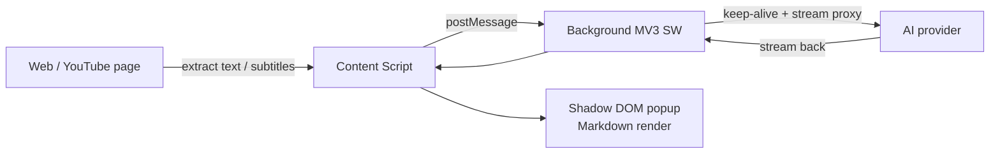

<div align="center">


# Bridge Translator

**A bilingual translation browser extension with AI web-page & YouTube video summarization**

[](https://github.com/b91814513-commits/bridge-translator/releases)
[](https://github.com/fishjar/kiss-translator)
[](LICENSE)
[](#-installation)
[]()

[中文](README.md) · **English** · [日本語](README.ja.md) · [한국어](README.ko.md)

</div>

> [!IMPORTANT]
> **This project is built on top of the open-source [KISS Translator](https://github.com/fishjar/kiss-translator) (by [@fishjar](https://github.com/fishjar)), v2.0.28.**
> Bridge Translator **fully inherits** KISS Translator's powerful translation capabilities, and adds **AI web-page summarization** and **YouTube video summarization**, along with substantial improvements to stability, UI, and sync.
> Heartfelt thanks to fishjar and all KISS Translator contributors 🙏. This project is released under the upstream **GPL-3.0** license.

---

## 📖 What is this

Bridge Translator is a Manifest V3 browser extension for Chrome / Edge / Firefox. It keeps all of KISS Translator's bilingual translation abilities (in-page translation, selection, input box, mouse-hover, YouTube subtitles, 25+ translation services…), and extends "**translation**" into "**understanding**" — using your own AI provider to **summarize an entire web page** or **an entire video** in one click, so long content reads faster.

> The upstream translation features are only touched on briefly here. The focus below is **what Bridge Translator adds and improves over KISS Translator**.

## ✨ What's new & improved vs. KISS Translator

| Capability | KISS Translator v2.0.28 (upstream) | Bridge Translator |
|---|:---:|---|
| Bilingual page / selection / input / hover translation | ✅ | ✅ Fully inherited |
| YouTube subtitle translation + AI segmentation | ✅ | ✅ Inherited + sidebar integration |
| **AI web-page summary** | ❌ | ✅ One click · structured · `Alt+W` |
| **YouTube video summary** | ❌ | ✅ Sidebar tab · timestamped sections |
| UI theme | Default | 🎀 Brand-new pink theme + rebrand |
| Sync & backup | KISS-Worker / WebDAV / Gist | Split upload/download · local import/export · WebDAV / Gist |
| MV3 streaming stability | — | Keep-alive + timeout fallback, fixes stream hangs |

### 🆕 AI web-page summary

Extracts the current page's main content in one click (auto-stripping nav, ads, footers; prioritizing `<article>` / `<main>` / content areas), then asks your configured AI provider for a **structured summary** — an overview, key points, and details — rendered as Markdown with one-click copy. Default shortcut `Alt+W`.

<div align="center">

<br/><i>Summarizing the KISS Translator project page — overview, key points and details at a glance</i>
</div>

### 🎬 YouTube video summary

Adds a "**Video Summary**" tab to the YouTube sidebar. Based on the video's bilingual subtitles (with timestamps), it generates "**key points + section details**", each labeled with a timestamp so you can skim and jump through long videos.

<div align="center">

<br/><i>"Key points" distill the whole video; "Section details" break it down by timestamp (0:03 / 1:04…)</i>
</div>

### 🎧 Bilingual subtitles (enhanced)

The sidebar unifies "**Bilingual Subtitles / Vocabulary / Video Summary**"; subtitles can be exported as **VTT** or **raw JSON**; when a subtitle request isn't intercepted, it **actively pulls as a fallback** so you never get stuck "waiting for subtitles".

<div align="center">

<br/><i>Line-by-line bilingual subtitles with timestamp jumping; export to VTT / JSON</i>
</div>

### 🎨 New look: pink theme + rebrand

Renamed to **Bridge Translator**, with a signature **pink bridge** icon in all sizes; the light-pink theme is fixed and applied across the options page, popup, and selection box.

<div align="center">

<br/><i>A clean light-pink options UI; shortcuts (including "Summarize page — Alt+W") are customizable</i>
</div>

### 🔁 Sync & backup improvements

- **Split upload / download**: separate buttons to avoid a one-click sync accidentally overwriting cloud or local data.
- **Local config import / export**: back up and migrate all settings without any cloud; exports **exclude API keys, sync passwords and other secrets**.
- **Sync encryption passphrase**: cloud data is stored encrypted; sync backends are streamlined to **WebDAV** and **GitHub Gist**.

<div align="center">

<br/><i>Split upload/download + local import/export for safer, controllable migration and backup</i>
</div>

### 🛡️ Stability & engineering

- **Fixed MV3 streaming hangs**: added **Service Worker keep-alive + foreground fallback timeout + idle timeout** to the background AI stream proxy, fixing subtitle translation "infinite loading" and web-summary "Failed to fetch".
- **All page-level injected UI is Shadow-DOM isolated**: components bind their own emotion cache, so the pink theme never leaks into host pages.
- **Added CI & unit tests**: a GitHub Actions pipeline plus related tests for better maintainability.

## 🧩 Core capabilities inherited from upstream

The following come from KISS Translator and are fully preserved:

- 🌐 Bilingual **in-page translation** (auto-detect + manual-rule modes)
- 🖱️ **Selection** / **input box** / **mouse-hover** translation, English dictionary, saved words
- 🎞️ **YouTube subtitle** bilingual translation with AI segmentation
- 🔌 **25+ translation services**: Google / Microsoft / DeepL / OpenAI / Gemini / Claude / DeepSeek / Ollama / OpenRouter / Tongyi / Volcengine …
- 🎯 Custom rules, rule subscriptions, AI glossary, streaming, AI context memory
- 🖥️ Multi-target: **Chrome / Edge / Firefox / Thunderbird** (and userscript)

## 🚀 Installation

### Option 1: From Releases (recommended)

1. Download the latest `bridge-translator-chrome.zip` from [Releases](https://github.com/b91814513-commits/bridge-translator/releases).
2. Unzip it anywhere.
3. Open `chrome://extensions/` and enable **Developer mode** (top-right).
4. Click **Load unpacked** and select the unzipped folder.

### Option 2: Build from source

```bash
# Requires Node.js 18+ and pnpm 9.14.4
git clone https://github.com/b91814513-commits/bridge-translator.git
cd bridge-translator
pnpm install
pnpm build:chrome      # output → build/chrome/
```

Then load `build/chrome/` via `chrome://extensions/`.

> [!TIP]
> **Configure an AI provider first**: web summary, video summary and AI translation all require an API key for any OpenAI-compatible / Gemini / Claude / DeepSeek provider, set under the extension's **API settings**.

## ⌨️ Shortcuts

| Shortcut | Action |
|---|---|
| `Alt+W` | Generate an AI summary of the current page |
| `Alt+Q` | Toggle page translation |
| `Alt+K` | Open the extension popup |
| `Alt+S` | Open the selection translation box |
| `Alt+C` | Cycle translation styles |

> All shortcuts are customizable in **Basic Settings**.

## 🛠️ Development

```bash
pnpm start             # Web dev server (REACT_APP_CLIENT=web)
pnpm build:chrome      # Build Chrome extension only
pnpm build             # Build all targets (Chrome/Edge/Firefox/Thunderbird/Web/userscript)
pnpm test              # Run Jest tests
pnpm format            # Prettier
```

One codebase produces browser extensions, a web homepage, and userscripts via the `REACT_APP_CLIENT` env var and Webpack multi-config. See [AGENTS.md](AGENTS.md) for more.

## 🧱 Tech stack & architecture

**Stack**: React 18 · MUI 5 · Emotion · react-markdown · webextension-polyfill · Manifest V3 (Service Worker) · Webpack (react-app-rewired) · pnpm.

AI summary data flow:



## 🙏 Acknowledgments

Bridge Translator stands on the shoulders of giants. Its core translation engine, rule system, and subtitle framework all come from [**KISS Translator**](https://github.com/fishjar/kiss-translator), created by [@fishjar](https://github.com/fishjar) and many contributors. This project would not exist without their open-source work. Thank you ❤️.

## 📄 License

Released under [**GPL-3.0**](LICENSE) (inherited from upstream KISS Translator). You may freely use, modify and redistribute it, but derivative works must also be open-sourced under GPL-3.0.
