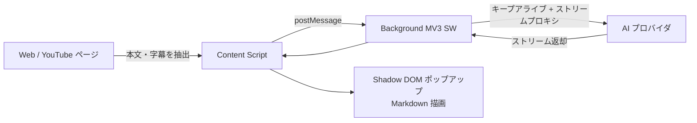

<div align="center">


# Bridge Translator

**AI によるWebページ要約・YouTube動画要約を備えた対訳翻訳ブラウザ拡張機能**

[](https://github.com/b91814513-commits/bridge-translator/releases)
[](https://github.com/fishjar/kiss-translator)
[](LICENSE)
[](#-インストール)
[]()

[中文](README.md) · [English](README.en.md) · **日本語** · [한국어](README.ko.md)

</div>

> [!IMPORTANT]
> **本プロジェクトは、オープンソースの [KISS Translator](https://github.com/fishjar/kiss-translator)（作者 [@fishjar](https://github.com/fishjar)）v2.0.28 をベースに二次開発したものです。**
> Bridge Translator は KISS Translator の強力な翻訳機能を**そのまま継承**しつつ、**AI Webページ要約**と **YouTube動画要約** を追加し、安定性・UI・同期を大幅に改善しています。
> fishjar 氏および KISS Translator のすべての貢献者に心より感謝します 🙏。本プロジェクトは上流の **GPL-3.0** ライセンスに従います。

---

## 📖 これは何？

Bridge Translator は Chrome / Edge / Firefox 向けの Manifest V3 ブラウザ拡張機能です。KISS Translator の対訳翻訳機能（Webページ翻訳・選択翻訳・入力欄翻訳・マウスホバー翻訳・YouTube字幕・25以上の翻訳サービス…）をすべて維持したうえで、「**翻訳**」を「**理解**」へと拡張します。ご自身の AI プロバイダを使い、ワンクリックで **Webページ全体の要約** や **動画全体の要約** を生成し、長いコンテンツをすばやく読めます。

> 上流の翻訳機能はここでは簡単に触れる程度にとどめます。以下では **Bridge Translator が KISS Translator に対して追加・強化した点** を中心に説明します。

## ✨ KISS Translator に対する追加・強化点

| 機能 | KISS Translator v2.0.28（上流） | Bridge Translator |
|---|:---:|---|
| 対訳Web翻訳 / 選択 / 入力欄 / ホバー | ✅ | ✅ 完全継承 |
| YouTube字幕翻訳 + AI 区切り | ✅ | ✅ 継承 + サイドバー統合 |
| **AI Webページ要約** | ❌ | ✅ ワンクリック · 構造化 · `Alt+W` |
| **YouTube動画要約** | ❌ | ✅ サイドバータブ · タイムスタンプ付き |
| UI テーマ | デフォルト | 🎀 新しいピンクテーマ + リブランド |
| 同期・バックアップ | KISS-Worker / WebDAV / Gist | アップロード/ダウンロード分離 · ローカル入出力 · WebDAV / Gist |
| MV3 ストリーミング安定性 | — | キープアライブ + タイムアウトで停止を修正 |

### 🆕 AI Webページ要約

現在のページの本文をワンクリックで抽出し（ナビ・広告・フッターなどを自動除去し、`<article>` / `<main>` / 本文領域を優先）、設定した AI プロバイダで**構造化された要約**（概要・要点・詳細）を生成、Markdown で表示しワンクリックコピーできます。デフォルトショートカットは `Alt+W`。

<div align="center">

<br/><i>KISS Translator のプロジェクトページを要約中 — 概要・要点・詳細がひと目で分かる</i>
</div>

### 🎬 YouTube動画要約

YouTube のサイドバーに「**動画要約**」タブを追加。動画の対訳字幕（タイムスタンプ付き）をもとに「**要点 + セクション詳細**」を生成し、各セクションに時間が付くため、長い動画も素早く拾い読み・ジャンプできます。

<div align="center">

<br/><i>「要点」で全体を把握、「セクション詳細」でタイムスタンプ（0:03 / 1:04…）ごとに整理</i>
</div>

### 🎧 対訳字幕（強化）

サイドバーで「**対訳字幕 / 単語帳 / 動画要約**」を一箇所に統合。字幕は **VTT** または **生データ JSON** でエクスポート可能。字幕リクエストが捕捉できない場合は**自動取得のフォールバック**が働き、「字幕待ち」で止まりません。

<div align="center">

<br/><i>行ごとの対訳字幕とタイムスタンプ移動、VTT / JSON でダウンロード可能</i>
</div>

### 🎨 新しい外観：ピンクテーマ + リブランド

名称を **Bridge Translator** に統一し、象徴的な**ピンクの橋**アイコンを全サイズで用意。ライトピンクテーマを修正して、設定ページ・ポップアップ・選択ボックスなど全 UI に適用しました。

<div align="center">

<br/><i>すっきりしたライトピンクの設定画面。ショートカット（「ページ要約 — Alt+W」を含む）はカスタマイズ可能</i>
</div>

### 🔁 同期・バックアップの改善

- **アップロード / ダウンロード分離**：ボタンを分け、ワンクリック同期でクラウドやローカルを誤って上書きしないようにしました。
- **ローカル設定の入出力**：クラウドなしで全設定をバックアップ・移行可能。エクスポートには **API キーや同期パスワードなどの機密情報は含まれません**。
- **同期用暗号パスフレーズ**：クラウドデータは暗号化保存。同期バックエンドは **WebDAV** と **GitHub Gist** に整理。

<div align="center">

<br/><i>アップロード/ダウンロード分離 + ローカル入出力で、より安全に移行・バックアップ</i>
</div>

### 🛡️ 安定性・エンジニアリング

- **MV3 ストリーミング停止を修正**：バックグラウンドの AI ストリームプロキシに **Service Worker キープアライブ + フォアグラウンドのフォールバックタイムアウト + アイドルタイムアウト** を追加し、字幕翻訳の「無限読み込み」と Web要約の「Failed to fetch」を解消。
- **ページ内注入 UI をすべて Shadow DOM で隔離**：各コンポーネントが独自の emotion cache を持ち、ピンクテーマがホストページに漏れません。
- **CI とユニットテストを追加**：GitHub Actions パイプラインと関連テストで保守性を向上。

## 🧩 上流から継承した中核機能

以下は KISS Translator 由来で、Bridge Translator でも完全に維持しています：

- 🌐 Webページの**対訳翻訳**（自動判定 + 手動ルールの2モード）
- 🖱️ **選択** / **入力欄** / **マウスホバー**翻訳、英英辞書、単語のお気に入り
- 🎞️ **YouTube字幕**の対訳翻訳と AI 区切り
- 🔌 **25以上の翻訳サービス**：Google / Microsoft / DeepL / OpenAI / Gemini / Claude / DeepSeek / Ollama / OpenRouter / 通義 / 火山 …
- 🎯 カスタムルール、ルール購読、AI 用語集、ストリーミング、AI コンテキスト記憶
- 🖥️ マルチターゲット：**Chrome / Edge / Firefox / Thunderbird**（およびユーザースクリプト）

## 🚀 インストール

### 方法1：Releases から（推奨）

1. [Releases](https://github.com/b91814513-commits/bridge-translator/releases) から最新の `bridge-translator-chrome.zip` をダウンロード。
2. 任意の場所に解凍。
3. `chrome://extensions/` を開き、右上の「**デベロッパーモード**」を有効化。
4. 「**パッケージ化されていない拡張機能を読み込む**」で解凍したフォルダを選択。

### 方法2：ソースからビルド

```bash
# Node.js 18+ と pnpm 9.14.4 が必要
git clone https://github.com/b91814513-commits/bridge-translator.git
cd bridge-translator
pnpm install
pnpm build:chrome      # 出力先 → build/chrome/
```

その後、`chrome://extensions/` で `build/chrome/` を読み込みます。

> [!TIP]
> **AI 機能の利用前に接続設定が必要です**：Webページ要約・動画要約・AI 翻訳には、OpenAI 互換 / Gemini / Claude / DeepSeek などの API キーを拡張機能の「**接続設定**」で設定してください。

## ⌨️ ショートカット

| ショートカット | 機能 |
|---|---|
| `Alt+W` | 現在のページの AI 要約を生成 |
| `Alt+Q` | ページ翻訳の切り替え |
| `Alt+K` | 拡張機能のポップアップを開く |
| `Alt+S` | 選択翻訳ボックスを開く |
| `Alt+C` | 訳文スタイルを切り替え |

> すべてのショートカットは「基本設定」でカスタマイズできます。

## 🛠️ 開発

```bash
pnpm start             # Web 開発サーバー（REACT_APP_CLIENT=web）
pnpm build:chrome      # Chrome 拡張のみビルド
pnpm build             # 全ターゲットをビルド（Chrome/Edge/Firefox/Thunderbird/Web/ユーザースクリプト）
pnpm test              # Jest テスト実行
pnpm format            # Prettier
```

`REACT_APP_CLIENT` 環境変数と Webpack マルチ設定により、1つのコードベースからブラウザ拡張・Webホームページ・ユーザースクリプトを生成します。詳細は [AGENTS.md](AGENTS.md) を参照。

## 🧱 技術スタックとアーキテクチャ

**スタック**：React 18 · MUI 5 · Emotion · react-markdown · webextension-polyfill · Manifest V3（Service Worker）· Webpack（react-app-rewired）· pnpm。

AI 要約のデータフロー：



## 🙏 謝辞

Bridge Translator は巨人の肩の上に立っています。中核となる翻訳エンジン、ルールシステム、字幕フレームワークはすべて [**KISS Translator**](https://github.com/fishjar/kiss-translator)（作者 [@fishjar](https://github.com/fishjar) と多くの貢献者）に由来します。彼らのオープンソースの成果なくして本プロジェクトは存在しません。心より感謝します ❤️。

## 📄 ライセンス

本プロジェクトは [**GPL-3.0**](LICENSE)（上流 KISS Translator から継承）に従います。自由に使用・改変・再配布できますが、派生物も同じく GPL-3.0 で公開する必要があります。
