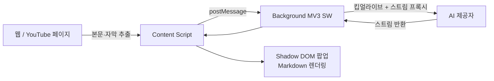

<div align="center">


# Bridge Translator

**AI 웹페이지 요약과 YouTube 동영상 요약을 갖춘 이중 언어 대조 번역 브라우저 확장 프로그램**

[](https://github.com/b91814513-commits/bridge-translator/releases)
[](https://github.com/fishjar/kiss-translator)
[](LICENSE)
[](#-설치)
[]()

[中文](README.md) · [English](README.en.md) · [日本語](README.ja.md) · **한국어**

</div>

> [!IMPORTANT]
> **본 프로젝트는 오픈소스 [KISS Translator](https://github.com/fishjar/kiss-translator)([@fishjar](https://github.com/fishjar) 제작) v2.0.28 을 기반으로 2차 개발한 것입니다.**
> Bridge Translator 는 KISS Translator 의 강력한 번역 기능을 **그대로 계승**하면서 **AI 웹페이지 요약** 과 **YouTube 동영상 요약** 을 추가하고, 안정성·UI·동기화를 대폭 개선했습니다.
> fishjar 님과 KISS Translator 의 모든 기여자분들께 진심으로 감사드립니다 🙏. 본 프로젝트는 상류의 **GPL-3.0** 라이선스를 따릅니다.

---

## 📖 무엇인가요?

Bridge Translator 는 Chrome / Edge / Firefox 용 Manifest V3 브라우저 확장 프로그램입니다. KISS Translator 의 대조 번역 기능(웹페이지 번역·선택 번역·입력창 번역·마우스 호버 번역·YouTube 자막·25종 이상의 번역 서비스…)을 모두 유지하면서 "**번역**" 을 "**이해**" 로 확장합니다. 본인의 AI 제공자를 사용해 클릭 한 번으로 **웹페이지 전체 요약** 이나 **동영상 전체 요약** 을 생성하여 긴 콘텐츠를 더 빠르게 읽을 수 있습니다.

> 상류의 번역 기능은 여기서 간단히만 언급합니다. 아래에서는 **Bridge Translator 가 KISS Translator 대비 추가·개선한 부분** 을 중심으로 설명합니다.

## ✨ KISS Translator 대비 추가·개선 사항

| 기능 | KISS Translator v2.0.28(상류) | Bridge Translator |
|---|:---:|---|
| 대조 웹 번역 / 선택 / 입력창 / 호버 | ✅ | ✅ 완전 계승 |
| YouTube 자막 번역 + AI 문장 분할 | ✅ | ✅ 계승 + 사이드바 통합 |
| **AI 웹페이지 요약** | ❌ | ✅ 원클릭 · 구조화 · `Alt+W` |
| **YouTube 동영상 요약** | ❌ | ✅ 사이드바 탭 · 타임스탬프 포함 |
| UI 테마 | 기본 | 🎀 새 핑크 테마 + 리브랜딩 |
| 동기화·백업 | KISS-Worker / WebDAV / Gist | 업로드/다운로드 분리 · 로컬 가져오기/내보내기 · WebDAV / Gist |
| MV3 스트리밍 안정성 | — | 킵얼라이브 + 타임아웃으로 멈춤 해결 |

### 🆕 AI 웹페이지 요약

현재 페이지의 본문을 클릭 한 번으로 추출하고(내비게이션·광고·푸터 등 노이즈를 자동 제거하고 `<article>` / `<main>` / 본문 영역을 우선), 설정한 AI 제공자로 **구조화된 요약**(개요 + 핵심 + 상세)을 생성해 Markdown 으로 렌더링하며 원클릭 복사를 지원합니다. 기본 단축키는 `Alt+W`.

<div align="center">

<br/><i>KISS Translator 프로젝트 페이지를 요약하는 모습 — 개요·핵심·상세를 한눈에</i>
</div>

### 🎬 YouTube 동영상 요약

YouTube 사이드바에 "**동영상 요약**" 탭을 추가했습니다. 동영상의 이중 언어 자막(타임스탬프 포함)을 기반으로 "**핵심 요점 + 구간별 상세**" 를 생성하며, 각 구간에 시간이 표시되어 긴 영상도 빠르게 훑고 이동할 수 있습니다.

<div align="center">

<br/><i>"핵심 요점" 으로 전체를 파악하고, "구간별 상세" 로 타임스탬프(0:03 / 1:04…)별로 정리</i>
</div>

### 🎧 이중 언어 자막(강화)

사이드바에서 "**이중 언어 자막 / 단어장 / 동영상 요약**" 을 한곳에 통합했습니다. 자막은 **VTT** 또는 **원본 JSON** 으로 내보낼 수 있으며, 자막 요청이 가로채지지 않을 때는 **능동적으로 가져오는 폴백** 이 동작해 "자막 대기" 에서 멈추지 않습니다.

<div align="center">

<br/><i>줄 단위 대조 자막과 타임스탬프 이동, VTT / JSON 다운로드 지원</i>
</div>

### 🎨 새로운 디자인: 핑크 테마 + 리브랜딩

이름을 **Bridge Translator** 로 통일하고, 상징적인 **핑크 다리** 아이콘을 전체 크기로 준비했습니다. 라이트 핑크 테마를 수정해 설정 페이지·팝업·선택 상자 등 모든 UI 에 적용했습니다.

<div align="center">

<br/><i>깔끔한 라이트 핑크 설정 화면. 단축키("웹페이지 요약 — Alt+W" 포함)는 사용자 지정 가능</i>
</div>

### 🔁 동기화·백업 개선

- **업로드 / 다운로드 분리**: 버튼을 분리해 원클릭 동기화가 클라우드나 로컬 데이터를 실수로 덮어쓰지 않도록 했습니다.
- **로컬 설정 가져오기 / 내보내기**: 클라우드 없이 모든 설정을 백업·이전할 수 있으며, 내보내기에는 **API 키·동기화 비밀번호 등 민감 정보가 포함되지 않습니다**.
- **동기화 암호화 구문**: 클라우드 데이터는 암호화 저장되며, 동기화 백엔드는 **WebDAV** 와 **GitHub Gist** 로 정리했습니다.

<div align="center">

<br/><i>업로드/다운로드 분리 + 로컬 가져오기/내보내기로 더 안전하고 통제 가능한 이전·백업</i>
</div>

### 🛡️ 안정성·엔지니어링

- **MV3 스트리밍 멈춤 수정**: 백그라운드 AI 스트림 프록시에 **Service Worker 킵얼라이브 + 포그라운드 폴백 타임아웃 + 유휴 타임아웃** 을 추가해 자막 번역 "무한 로딩" 과 웹 요약 "Failed to fetch" 를 해결했습니다.
- **페이지 수준 주입 UI 를 모두 Shadow DOM 으로 격리**: 각 컴포넌트가 자체 emotion cache 를 사용해 핑크 테마가 호스트 페이지로 새지 않습니다.
- **CI 및 단위 테스트 추가**: GitHub Actions 파이프라인과 관련 테스트로 유지보수성을 높였습니다.

## 🧩 상류에서 계승한 핵심 기능

다음 기능은 KISS Translator 에서 왔으며 Bridge Translator 에서도 완전히 유지됩니다:

- 🌐 웹페이지 **대조 번역**(자동 감지 + 수동 규칙 두 가지 모드)
- 🖱️ **선택** / **입력창** / **마우스 호버** 번역, 영어 사전, 단어 즐겨찾기
- 🎞️ **YouTube 자막** 이중 언어 번역과 AI 문장 분할
- 🔌 **25종 이상의 번역 서비스**: Google / Microsoft / DeepL / OpenAI / Gemini / Claude / DeepSeek / Ollama / OpenRouter / 통이 / 볼케이노 …
- 🎯 사용자 지정 규칙, 규칙 구독, AI 용어집, 스트리밍, AI 문맥 기억
- 🖥️ 다중 타깃: **Chrome / Edge / Firefox / Thunderbird**(및 유저스크립트)

## 🚀 설치

### 방법 1: Releases 에서(권장)

1. [Releases](https://github.com/b91814513-commits/bridge-translator/releases) 에서 최신 `bridge-translator-chrome.zip` 을 다운로드합니다.
2. 원하는 위치에 압축을 풉니다.
3. `chrome://extensions/` 를 열고 오른쪽 위의 "**개발자 모드**" 를 켭니다.
4. "**압축해제된 확장 프로그램을 로드합니다**" 를 클릭하고 압축 푼 폴더를 선택합니다.

### 방법 2: 소스에서 빌드

```bash
# Node.js 18+ 와 pnpm 9.14.4 필요
git clone https://github.com/b91814513-commits/bridge-translator.git
cd bridge-translator
pnpm install
pnpm build:chrome      # 출력 → build/chrome/
```

그 후 `chrome://extensions/` 에서 `build/chrome/` 를 로드합니다.

> [!TIP]
> **AI 기능 사용 전 연결 설정이 필요합니다**: 웹페이지 요약·동영상 요약·AI 번역에는 OpenAI 호환 / Gemini / Claude / DeepSeek 등의 API 키를 확장 프로그램의 "**연결 설정**" 에 입력해야 합니다.

## ⌨️ 단축키

| 단축키 | 기능 |
|---|---|
| `Alt+W` | 현재 페이지의 AI 요약 생성 |
| `Alt+Q` | 페이지 번역 켜기/끄기 |
| `Alt+K` | 확장 프로그램 팝업 열기 |
| `Alt+S` | 선택 번역 상자 열기 |
| `Alt+C` | 번역문 스타일 전환 |

> 모든 단축키는 "기본 설정" 에서 사용자 지정할 수 있습니다.

## 🛠️ 개발

```bash
pnpm start             # 웹 개발 서버(REACT_APP_CLIENT=web)
pnpm build:chrome      # Chrome 확장만 빌드
pnpm build             # 전체 타깃 빌드(Chrome/Edge/Firefox/Thunderbird/Web/유저스크립트)
pnpm test              # Jest 테스트 실행
pnpm format            # Prettier
```

`REACT_APP_CLIENT` 환경 변수와 Webpack 다중 설정을 통해 하나의 코드베이스에서 브라우저 확장·웹 홈페이지·유저스크립트를 생성합니다. 자세한 내용은 [AGENTS.md](AGENTS.md) 참고.

## 🧱 기술 스택과 아키텍처

**스택**: React 18 · MUI 5 · Emotion · react-markdown · webextension-polyfill · Manifest V3(Service Worker) · Webpack(react-app-rewired) · pnpm.

AI 요약 데이터 흐름:



## 🙏 감사의 말

Bridge Translator 는 거인의 어깨 위에 서 있습니다. 핵심 번역 엔진, 규칙 시스템, 자막 프레임워크는 모두 [**KISS Translator**](https://github.com/fishjar/kiss-translator)([@fishjar](https://github.com/fishjar) 와 많은 기여자 제작)에서 왔습니다. 그들의 오픈소스 작업이 없었다면 본 프로젝트도 없었을 것입니다. 진심으로 감사드립니다 ❤️.

## 📄 라이선스

본 프로젝트는 [**GPL-3.0**](LICENSE)(상류 KISS Translator 에서 계승)를 따릅니다. 자유롭게 사용·수정·재배포할 수 있으나, 파생물도 동일하게 GPL-3.0 으로 공개해야 합니다.
