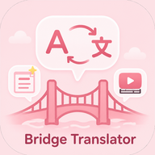
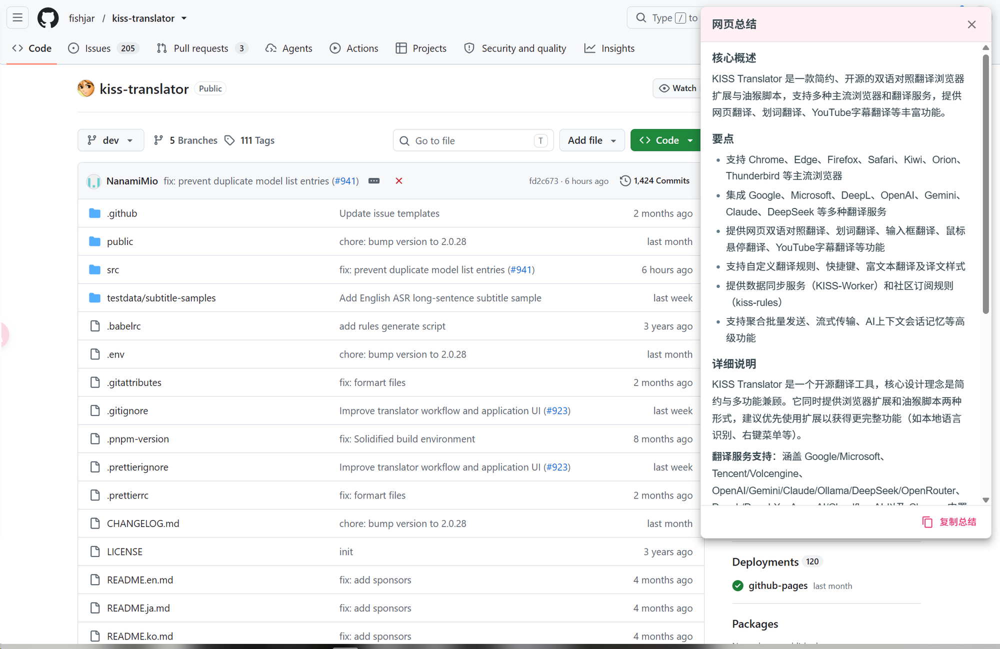
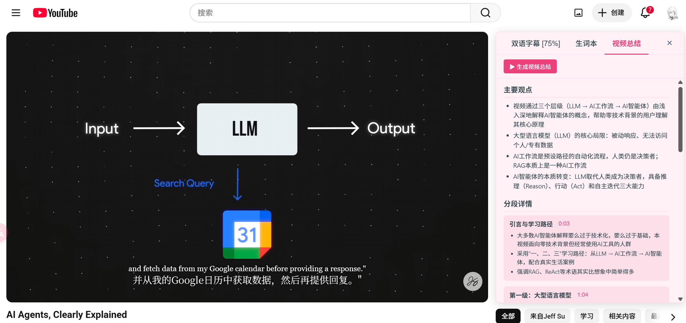
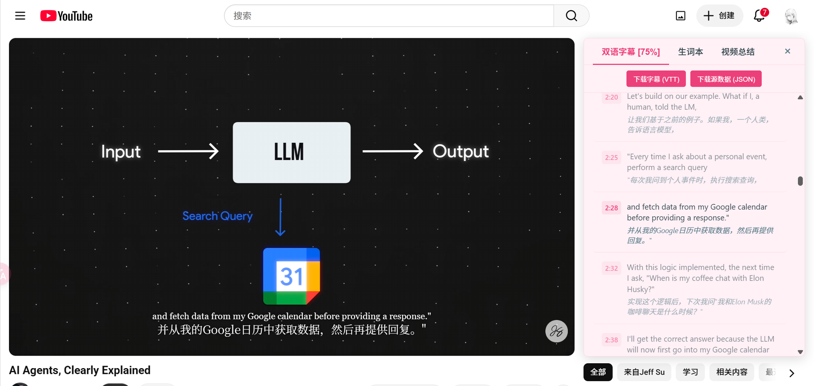
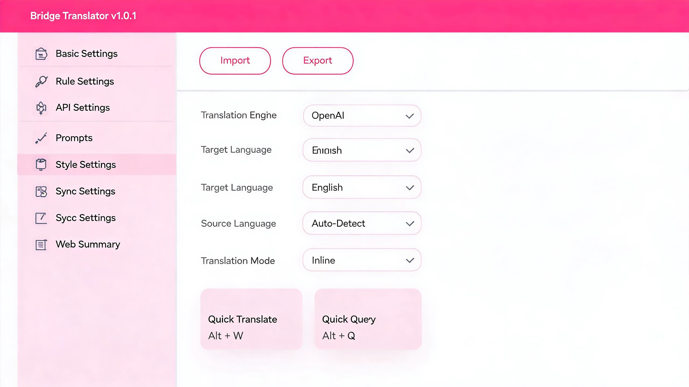
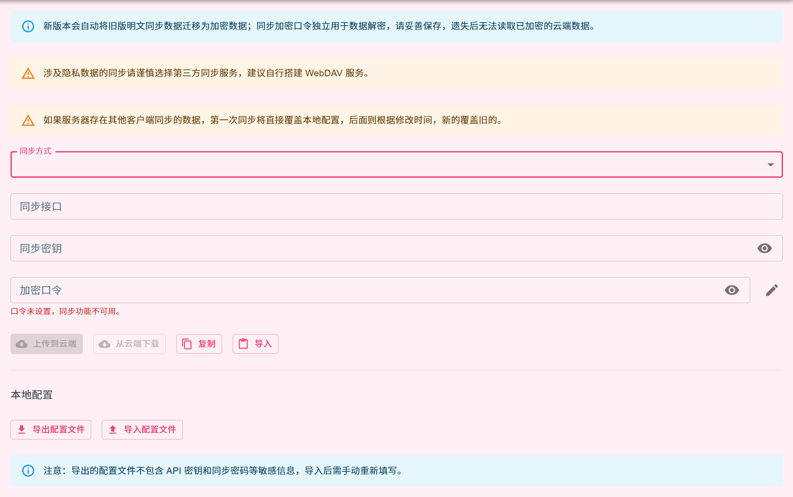
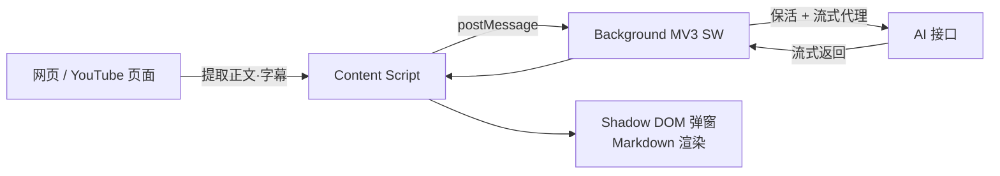

<div align="center">



# Bridge Translator

**一款带 AI 网页总结与 YouTube 视频总结的双语对照翻译浏览器扩展**

[](https://github.com/b91814513-commits/bridge-translator/releases)
[](https://github.com/fishjar/kiss-translator)
[](LICENSE)
[](#-安装)
[]()

**中文** · [English](README.en.md) · [日本語](README.ja.md) · [한국어](README.ko.md)

</div>

> [!IMPORTANT]
> **本项目基于开源项目 [KISS Translator](https://github.com/fishjar/kiss-translator)（作者 [@fishjar](https://github.com/fishjar)）v2.0.28 二次开发而来。**
> Bridge Translator 在**完整继承** KISS Translator 强大翻译能力的基础上，新增了 **AI 网页总结**、**YouTube 视频总结**，并对稳定性、界面与同步机制进行了大量优化。
> 衷心感谢 fishjar 及 KISS Translator 全体贡献者的出色工作 🙏。本项目遵循上游 **GPL-3.0** 协议开源。

---

## 📖 这是什么

Bridge Translator 是一个基于 Manifest V3 的 Chrome / Edge / Firefox 浏览器扩展。它保留了上游 KISS Translator 全部的双语对照翻译能力（网页翻译、划词、输入框、悬停、YouTube 字幕、25+ 翻译服务……），并在此之上把「**翻译**」延伸到了「**理解**」——用你自己的 AI 接口，一键**总结整篇网页**、**总结整段视频**，让长内容读得更快。

> 上游的核心翻译功能这里不再赘述，下面重点介绍 **Bridge Translator 相比 KISS Translator 新增与增强的部分**。

## ✨ 相比 KISS Translator 的新增与增强

| 能力 | KISS Translator v2.0.28（上游） | Bridge Translator |
|---|:---:|---|
| 双语网页翻译 / 划词 / 输入框 / 悬停 | ✅ | ✅ 完整继承 |
| YouTube 字幕翻译 + AI 断句 | ✅ | ✅ 继承 + 侧栏整合 |
| **AI 网页总结** | ❌ | ✅ 一键 · 结构化中文 · `Alt+W` |
| **YouTube 视频总结** | ❌ | ✅ 侧栏 Tab · 带时间戳分段 |
| 界面主题 | 默认 | 🎀 全新浅粉色主题 + 品牌重塑 |
| 同步与备份 | KISS-Worker / WebDAV / Gist | 上传下载分离 · 本地配置导入导出 · WebDAV / Gist |
| MV3 流式稳定性 | — | 保活 + 超时兜底，修复流式挂起 |

### 🆕 AI 网页总结

一键提取当前网页正文（自动剔除导航、广告、页脚等噪声，优先识别 `<article>` / `<main>` 主内容区），交给你配置的 AI 接口生成**结构化的简体中文总结**——包含「核心概述 + 要点 + 详细说明」，以 Markdown 渲染并支持一键复制。默认快捷键 `Alt+W`。

<div align="center">

<br/><i>正在总结 KISS Translator 项目主页——结构化概述、要点与详细说明一目了然</i>
</div>

### 🎬 YouTube 视频总结

在 YouTube 播放页右侧边栏新增「**视频总结**」Tab。它基于视频的双语字幕（带时间戳）生成「**主要观点 + 分段详情**」，每个段落都标注时间点，让你在长视频里快速定位与跳读。

<div align="center">

<br/><i>「主要观点」提炼全片核心，「分段详情」按时间戳（0:03 / 1:04…）拆解脉络</i>
</div>

### 🎧 双语字幕（增强整合）

侧边栏把「**双语字幕 / 生词本 / 视频总结**」三大功能整合到一处；字幕支持导出为 **VTT** 或**源数据 JSON**；当字幕请求未被拦截时会**主动拉取兜底**，避免卡在「等待字幕」。

<div align="center">

<br/><i>逐句双语对照、时间戳定位，可一键下载 VTT / JSON</i>
</div>

### 🎨 全新界面：浅粉色主题 + 品牌重塑

统一更名为 **Bridge Translator**，配套标志性的**粉色桥梁**图标与全套尺寸；修复并启用了浅粉色（light-pink）主题，覆盖设置页、弹窗、划词框等所有界面。

<div align="center">

<br/><i>清爽的浅粉色设置界面，快捷键（含「总结网页 Alt+W」）均可自定义</i>
</div>

### 🔁 同步与备份优化

- **上传 / 下载分离**：拆分为独立按钮，避免一键同步误覆盖云端或本地数据。
- **本地配置导入 / 导出**：无需云端即可备份与迁移全部配置；导出文件**不含 API 密钥、同步密码等敏感信息**。
- **同步加密口令**：云端数据加密存储；精简同步后端为 **WebDAV** 与 **GitHub Gist**。

<div align="center">

<br/><i>上传/下载分离 + 本地配置导入导出，数据迁移与备份更安全可控</i>
</div>

### 🛡️ 稳定性与工程优化

- **修复 MV3 流式挂起**：为后台 AI 流式代理加入 **Service Worker 保活 + 前台保底超时 + 空闲超时**，解决字幕翻译「无限加载」与网页总结「Failed to fetch」。
- **页面级 UI 全部 Shadow DOM 隔离**：总结弹窗等注入组件绑定独立 emotion cache，杜绝浅粉色主题样式泄漏到宿主网页。
- **新增 CI 与单元测试**：补充 GitHub Actions 流水线与相关测试，提升可维护性。

## 🧩 继承自上游的核心能力

以下能力来自 KISS Translator，Bridge Translator 完整保留：

- 🌐 网页**双语对照翻译**（自动识别文本 + 手动规则两种模式）
- 🖱️ **划词翻译** / **输入框翻译** / **鼠标悬停翻译** / 英文词典 / 收藏词汇
- 🎞️ **YouTube 字幕**双语翻译与 AI 智能断句
- 🔌 **25+ 翻译服务**：Google / Microsoft / DeepL / OpenAI / Gemini / Claude / DeepSeek / Ollama / OpenRouter / 通义 / 火山 …
- 🎯 自定义规则、规则订阅、AI 术语词典、流式传输、AI 上下文会话记忆
- 🖥️ 多端支持：**Chrome / Edge / Firefox / Thunderbird**（及油猴脚本）

## 🚀 安装

### 方式一：从 Releases 安装（推荐）

1. 前往 [Releases](https://github.com/b91814513-commits/bridge-translator/releases) 下载最新的 `bridge-translator-chrome.zip`。
2. 解压到本地任意目录。
3. 打开 `chrome://extensions/`，开启右上角「**开发者模式**」。
4. 点击「**加载已解压的扩展程序**」，选择解压后的目录即可。

### 方式二：从源码构建

```bash
# 需要 Node.js 18+ 与 pnpm 9.14.4
git clone https://github.com/b91814513-commits/bridge-translator.git
cd bridge-translator
pnpm install
pnpm build:chrome      # 产物输出到 build/chrome/
```

构建完成后，在 `chrome://extensions/` 中加载 `build/chrome/` 目录。

> [!TIP]
> **使用 AI 功能前需先配置接口**：网页总结、视频总结及 AI 翻译都需要在扩展的「**接口设置**」中，填入任意 OpenAI 兼容 / Gemini / Claude / DeepSeek 等接口的 API Key。

## ⌨️ 快捷键

| 快捷键 | 功能 |
|---|---|
| `Alt+W` | 生成当前网页的 AI 总结 |
| `Alt+Q` | 开启 / 关闭页面翻译 |
| `Alt+K` | 打开扩展弹窗 |
| `Alt+S` | 打开划词翻译框 |
| `Alt+C` | 切换译文样式 |

> 以上快捷键均可在「基本设置」中自定义。

## 🛠️ 开发

```bash
pnpm start             # Web 开发服务器（REACT_APP_CLIENT=web）
pnpm build:chrome      # 仅构建 Chrome 扩展
pnpm build             # 构建全部目标（Chrome/Edge/Firefox/Thunderbird/Web/油猴）
pnpm test              # 运行 Jest 测试
pnpm format            # Prettier 格式化
```

同一套代码通过 `REACT_APP_CLIENT` 环境变量与 Webpack 多配置，产出浏览器扩展、Web 主页与油猴脚本。更多命令与架构说明见 [AGENTS.md](AGENTS.md)。

## 🧱 技术栈与架构

**技术栈**：React 18 · MUI 5 · Emotion · react-markdown · webextension-polyfill · Manifest V3（Service Worker）· Webpack（react-app-rewired）· pnpm。

AI 总结的数据流：



## 🙏 致谢

Bridge Translator 站在巨人的肩膀上。核心翻译引擎、规则系统、字幕框架等均来自 [**KISS Translator**](https://github.com/fishjar/kiss-translator)，由 [@fishjar](https://github.com/fishjar) 及众多贡献者打造。没有他们的开源工作，就没有本项目。再次致以诚挚的谢意 ❤️。

## 📄 许可证

本项目遵循 [**GPL-3.0**](LICENSE) 协议（继承自上游 KISS Translator）。你可以自由使用、修改与再分发，但衍生作品须同样以 GPL-3.0 开源。
